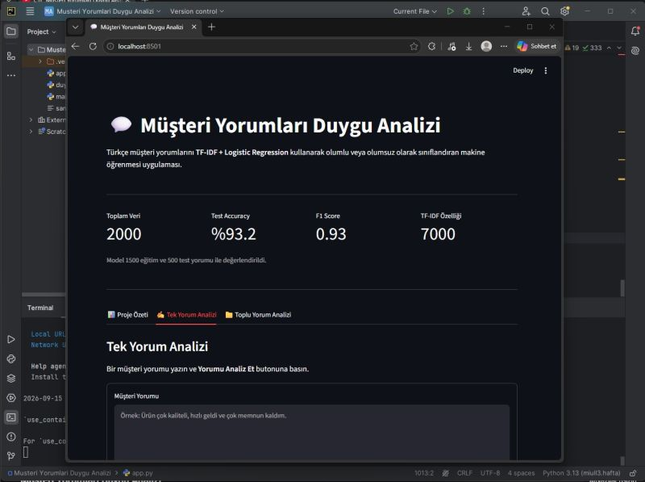
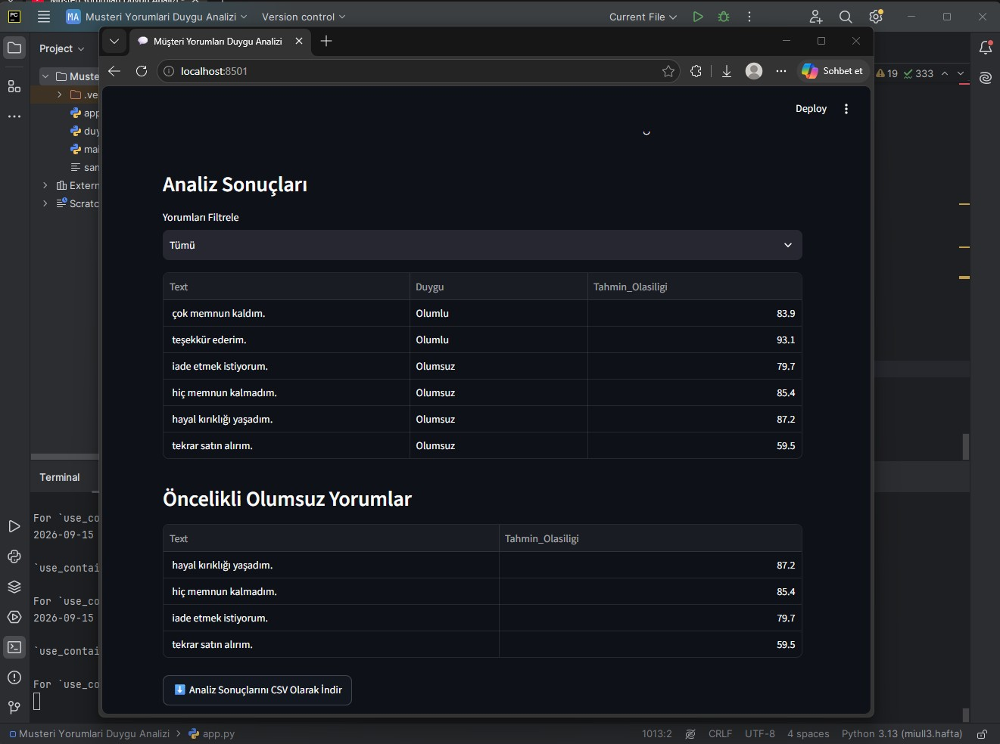

💬 Müşteri Yorumları Duygu Analizi

Müşteri yorumlarını analiz ederek yorumların duygu durumunu sınıflandırmaya yönelik geliştirdiğim Python tabanlı bir eğitim ve portföy projesidir.

🎯 Projenin Amacı
Bu projede müşteri yorumları üzerinden metin analizi ve duygu analizi sürecini uygulamalı olarak çalışmayı amaçladım.

Proje kapsamında:
Örnek müşteri yorumları için veri oluşturulur.
Duygu analizi modeli eğitilir.
Müşteri yorumları analiz edilir.
Yorumların duygu sınıfları belirlenir.
Sonuçlar kullanıcı arayüzü üzerinden görüntülenir.

📁 Proje Dosyaları

main.py — duygu analizi modelinin eğitilmesi

duygu_analizi.py — duygu analizi işlemlerinin gerçekleştirilmesi

app.py — uygulamanın kullanıcı arayüzü

## 📸 Uygulama Görüntüleri

## 🎥 Proje Videosu
Müşteri Yorumları Duygu Analizi projesinin kısa tanıtım videosunu YouTube kanalımda izleyebilirsiniz:
https://www.youtube.com/watch?v=1iRePdbG4lw
